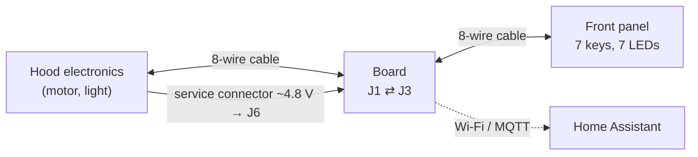
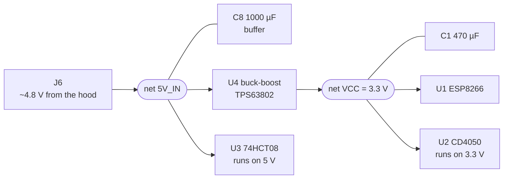
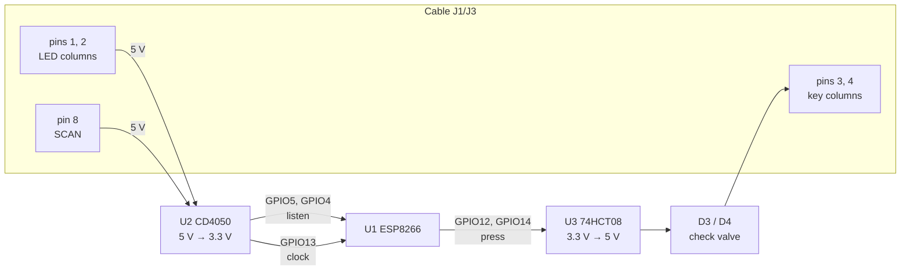

🇬🇧 **English** · 🇩🇪 [Deutsch](CIRCUIT.de.md)

# How the circuit works

This document explains the hood controller board (rev. 0.3) so that it can
be followed without an electronics background – and still makes sense years
from now. It explains the *why*. Exact part values, order numbers and layout
details are in [`kicad/DESIGN.md`](../kicad/DESIGN.md); the schematic is
available as [`kicad/schematic.pdf`](../kicad/schematic.pdf).

Contents:

1. [The job in one sentence](#1-the-job-in-one-sentence)
2. [A few basic terms](#2-a-few-basic-terms)
3. [How hood and front panel talk to each other](#3-how-hood-and-front-panel-talk-to-each-other)
4. [Board overview](#4-board-overview)
5. [Power supply](#5-power-supply)
6. [The ESP8266 microcontroller](#6-the-esp8266-microcontroller)
7. [Listening in: reading the scan signal and LED states (U2)](#7-listening-in-reading-the-scan-signal-and-led-states-u2)
8. [Joining in: pressing keys (U3, D3, D4)](#8-joining-in-pressing-keys-u3-d3-d4)
9. [Firmware in step with the hood](#9-firmware-in-step-with-the-hood)
10. [Reset, flashing and status LED](#10-reset-flashing-and-status-led)
11. [Connectors and test points](#11-connectors-and-test-points)
12. [What we learned during bring-up](#12-what-we-learned-during-bring-up)
13. [Troubleshooting: what to measure where](#13-troubleshooting-what-to-measure-where)

---

## 1. The job in one sentence

The board sits in the cable between the electronics of the range hood
(Gutmann Sombra) and its front panel, **reads which front-panel lights are
on**, and can **pretend someone pressed a key** – controlled over Wi-Fi/MQTT
from Home Assistant.

The original front panel keeps working normally. The board is just an extra
"listener with fingers".

---

## 2. A few basic terms

If you already know electronics, skip to section 3.

| Term | Meaning here |
|---|---|
| **HIGH / LOW** | Digital signals have only two states. LOW ≈ 0 V (ground), HIGH ≈ supply voltage, i.e. 5 V on the hood side and 3.3 V on the ESP side. |
| **Ground / GND** | The common 0 V reference. Voltages are always measured against GND. Without a common ground, two circuits cannot understand each other. |
| **Drive** | An output actively forcing a line HIGH or LOW. |
| **Floating / high-impedance** | A line nobody is pulling. Its level is random – it "floats". CMOS inputs must never float, or they toggle wildly. |
| **Pull-up / pull-down** | A resistor (usually 10 kΩ) that gently pulls a line HIGH (up) or LOW (down) while nobody drives it. A driver overrides it easily. |
| **Push-pull output** | An output that *always* drives – either HIGH or LOW. It cannot "let go". |
| **Diode** | An electrical one-way valve: current flows only from anode to cathode (cathode = the ring on the part). In the forward direction it "costs" about 0.6 V. |
| **Level shifter** | Translates between the 5 V world (hood) and the 3.3 V world (ESP). |
| **Capacitor (electrolytic, ceramic)** | A small energy store. Large electrolytics (µF) buffer current peaks; small ceramic capacitors (100 nF) right at each IC absorb high-frequency noise ("decoupling capacitor"). |
| **Absolute maximum** | A datasheet limit that must never be exceeded. For the ESP8266: 3.6 V on any pin. |

---

## 3. How hood and front panel talk to each other

Understanding this section is the key to everything else.

### The problem: 7 keys and 7 LEDs, but only 8 wires

Wiring every key and every LED separately would need 14 wires plus ground.
The hood gets by with an 8-wire network cable – thanks to **multiplexing**
(taking turns in time).

The front panel contains only passive parts: 7 keys, 7 LEDs and traces.
All the intelligence is in the hood.

### The matrix

Keys and LEDs are arranged in a grid of **4 rows** and **2 columns**:

- **4 scan lines (rows)** – the hood drives them to 5 V (HIGH) *one after
  another* for 1 ms each while the other three stay at 0 V. After 4 ms one
  round is complete and it starts over – 250 rounds per second.
- **2 key lines (columns)** – a key connects one row to one column. When
  the key is pressed, the row's HIGH pulse also appears on the column. So the
  hood sees: *"column 1 is HIGH while row 2 is active → that must be the fan
  level 3 key."*
- **2 LED lines (columns)** – for an LED that should be lit, the hood sets
  the LED column during exactly that row so that current flows through the
  LED. Each LED is therefore lit for only 1 ms out of 4 ms – the eye doesn't
  notice. Measured on the board, a **HIGH on the LED column in the middle
  of the row window means: LED on** (that is how the firmware evaluates it,
  and the reported states match the front panel).

```mermaid
gantt
    title One round = 4 ms (then row A starts again)
    dateFormat x
    axisFormat %L ms
    section Row A
    HIGH :a1, 0, 1ms
    section Row B
    HIGH :b1, 1, 1ms
    section Row C
    HIGH :c1, 2, 1ms
    section Row D
    HIGH :d1, 3, 1ms
    section Key column
    HIGH (key in row B pressed) :crit, t1, 1, 1ms
```

**The key insight:** electrically, pressing a key simply means bringing a key
column HIGH *in the right millisecond window*. That is exactly what the
board does. And reading an LED means looking at the LED column's level in
the right window.

### The wires of the cable

The cable is a network cable with T568B colour code. **It carries neither
ground nor supply** – the board gets those separately (section 5).

| Wire (pin) | Colour | Function | Board taps it |
|---|---|---|---|
| 1 | orange-white | LED column | yes → U2 → GPIO5 |
| 2 | orange | LED column | yes → U2 → GPIO4 |
| 3 | green-white | key column | yes ← D3 ← U3 ← GPIO12 |
| 4 | blue | key column | yes ← D4 ← U3 ← GPIO14 |
| 5, 6, 7 | blue-white, green, brown-white | three scan rows | no, just passed through |
| 8 | brown | scan row "SCAN" | yes → U2 → GPIO13 (clock reference) |

The board listens to only **one** of the four scan rows. That is enough:
once the start of a round is known, the other three rows follow from the
time (1 ms apart).

---

## 4. Board overview

| Part | Job in one sentence |
|---|---|
| **U1** ESP-12E | The microcontroller with Wi-Fi – the brain. |
| **U2** CD4050 | Translates the hood's 5 V signals to 3.3 V for the ESP. |
| **U3** 74HCT08 | Translates the ESP's 3.3 V signals to 5 V for the hood. |
| **D3, D4** | Make sure U3 can only pull the key lines up, never hold them. |
| **R7, R8** | Keep U3's inputs LOW while the ESP is still booting. |
| **U4** TPS63802 module | Turns the hood's ~4.8 V into a stable 3.3 V. |
| **C8, C1** | Large energy buffers before and after U4. |
| **C3–C6** | Decoupling capacitors, one right at each IC. |
| **R5** | Pulls the SCAN line cleanly LOW when it is not active. |
| **D1, D2** | Sit in the LED lines between front panel and hood (carried over from the perfboard version). |
| **R2, R3, R4, R6, C7, SW1, SW2, J5** | Boot, reset and flash circuitry of the ESP. |

---

## 5. Power supply

### Where the power comes from

The hood electronics has a **service connector** with about **4.8 V** that
can deliver roughly **500 mA** (measured). It is tapped with a shortened
ISA slot connector and soldered to **J6** (pin 1 = +, pin 2 = GND). This
connector also provides the **common ground** with the hood – without it the
board could not evaluate the signals in the cable at all, because voltages
are always measured relative to ground.

### Why 3.3 V and not simply 5 V

The ESP8266 runs on 3.3 V and tolerates **at most 3.6 V** on any pin. The
hood's 5 V would destroy it.

### Why a buck-boost converter (U4)

A switching converter turns one voltage into another without burning the
difference as heat like a linear regulator.

- A **buck** (step-down) converter needs clearly *more* input than output –
  typical modules 4.5 to 6 V. But the hood supplies only 4.8 V, and when the
  ESP briefly draws ~350 mA while transmitting, the voltage sags further.
  The buck then drops out of regulation, the ESP gets too little voltage,
  restarts, draws a lot of current again at start-up … That was the
  **brownout boot loop** of the old perfboard version.
- A **buck-boost** converter can also *step up*. The TPS63802 regulates
  cleanly to 3.3 V from 1.5 V to 5.5 V input. No matter how far the hood
  voltage dips briefly – the 3.3 V stay put.

**Caution:** the module ships set to 4.2 V and must be switched to **3.3 V**
with a solder bridge and measured before installation (also printed on the
board).

### The capacitors

- **C8, 1000 µF, at the 5 V input:** stores energy for short current peaks
  so the line from the hood doesn't dip with every Wi-Fi packet.
- **C1, 470 µF, at the 3.3 V output:** bridges the time (~100 µs) the
  converter needs to react to a sudden load change.
- **C3, C4, C5, C6, 100 nF each:** right at U1, U2, U3 and U4. ICs switch
  very fast and draw tiny but steep current spikes. These small capacitors
  supply them "from close by" before noise travels along the traces.

This gives **two supply nets**: `5V_IN` (hood, U3, C5, C8) and `VCC` =
3.3 V (ESP, U2, everything else).

---

## 6. The ESP8266 microcontroller

The **ESP-12E** is a ready-made module with the ESP8266 chip, flash memory
and antenna. The antenna is the zigzag trace on the short side; no copper
may be underneath it (keep-out zone on the left of the board).

Pins used:

| Pin | Direction | Function |
|---|---|---|
| GPIO13 | input | hood SCAN clock (via U2) |
| GPIO4, GPIO5 | input | LED columns (via U2) |
| GPIO12, GPIO14 | output | key columns (via U3 and D3/D4) |
| GPIO2 | output | blue status LED on the module |
| GPIO0, GPIO15, EN, RST | – | boot behaviour, see section 10 |
| TXD, RXD | – | serial interface for flashing (J2) |

---

## 7. Listening in: reading the scan signal and LED states (U2)

### The problem

The signals in the cable are 5 V. Connected directly to the ESP they would
exceed its 3.6 V limit.

### The solution: CD4050 as level shifter

The **CD4050** contains six "buffers": what goes in comes out unchanged.
Its special property: **its inputs tolerate up to 15 V even when the chip
itself is supplied with only 3.3 V.** The outputs, however, deliver only as
much as the supply provides.

Because U2 runs on 3.3 V, a 5 V HIGH in the cable becomes a 3.3 V HIGH at
the ESP – exactly right.

- Buffer A: LED column pin 2 → GPIO4
- Buffer B: LED column pin 1 → GPIO5
- Buffer C: SCAN (pin 8) → GPIO13
- Buffers D, E, F are unused. Their inputs (pins 9, 11, 14) are **tied to
  GND**, because open CMOS inputs would float and then draw current or
  oscillate.

Side effect: the CD4050's inputs are very high-impedance. The board puts
practically no load on the hood's lines while listening.

### R5: the pull-down on SCAN

The hood actively drives the SCAN row only *HIGH*. The rest of the time it
is not cleanly defined. **R5 (2.4 kΩ) to GND** then pulls it clearly LOW so
the ESP sees clean edges. The value is empirical: 10 kΩ was too weak,
~2.5 kΩ gave a clean signal.

---

## 8. Joining in: pressing keys (U3, D3, D4)

This is the trickiest part of the circuit – and the one that caused the most
trouble during bring-up.

### The requirement

The key columns belong to **the hood and the front panel**. The board must
be able to do two things:

1. **Press:** bring the column HIGH (~5 V) in the right time window.
2. **Do nothing:** leave the column **completely alone** so the real front
   panel keeps working – and that **in every state**: in normal operation,
   while the ESP boots, when it has crashed, and when it has no power at all.

### Step 1: 3.3 V → 5 V with the 74HCT08 (U3)

An ESP HIGH is only 3.3 V. The **74HCT08** is actually an AND gate (output
HIGH when both inputs are HIGH). Tie both inputs together and it becomes a
simple buffer: HIGH in → HIGH out.

Why the **HCT** family: it runs on 5 V but already recognises a HIGH **from
2.0 V**. The ESP's 3.3 V is therefore safely enough, and the output delivers
full 5 V. (A plain HC or CMOS part at 5 V would need ~3.5 V for a HIGH –
too marginal.)

- Gate A: GPIO12 → pins 1+2 → pin 3
- Gate B: GPIO14 → pins 4+5 → pin 6
- Gates C, D unused, inputs tied to GND (as with U2).

### Step 2: diodes D3 and D4 – why they are essential

U3 has **push-pull outputs**: it always drives either HIGH or LOW. If its
output were connected directly to the key column, it would **hold it LOW**
most of the time. The real front panel could then no longer report any key,
and random HIGH levels would make the hood see phantom keys.

The diode acts like a check valve:

| U3 output | Diode | Key column | Hood sees |
|---|---|---|---|
| HIGH (5 V) | conducts | ≈ 4.3 V | "key pressed" |
| LOW (0 V) | blocks | free | nothing – the front panel works normally |

The 0.6 V the diode "costs" don't matter: 4.3 V is a clear HIGH for the
hood's 5 V electronics.

Extra protection: the 5 V pulses on the column never reach the ESP. At most
they hit the blocking diode.

### Step 3: pull-downs R7 and R8

After power-up it takes a few hundred milliseconds until the firmware runs
and actively sets GPIO12/14 LOW. During that time the pins are undefined –
whereas U3 on 5 V is up immediately. Without further measures its inputs
would float and it could randomly output HIGH – a phantom key press right at
power-up.

**R7 and R8 (10 kΩ to GND each)** keep U3's inputs safely LOW during that
time. Once the ESP runs, it overrides them easily.

### Why not simpler?

Exactly these simpler variants were tried during bring-up and failed
(details in section 12):

| Variant | Result |
|---|---|
| U3 directly on the column (rev. 0.2) | ESP boot loop, hood shows phantom keys and stops responding |
| Wire link: GPIO directly on the column (as on the perfboard) | front panel LEDs only glow faintly, ESP hangs |
| 1–2.4 kΩ resistor instead of a wire | hood starts with an error code |
| **U3 + diode + pull-down (rev. 0.3)** | **works** |

The common reason the direct variants fail: if the ESP pin is electrically
connected to the column, its internal protection diodes act like a short to
the 3.3 V rail. While the ESP has no power yet, they pull the column down;
once it runs, the 5 V pulses feed back into its supply through them.

---

## 9. Firmware in step with the hood

The electronics alone are not enough – the ESP has to look and press at the
right moment. This is how the firmware ([`src/main.cpp`](../src/main.cpp))
does it:

### Synchronising

1. Every rising edge on **SCAN** (GPIO13) triggers an interrupt.
2. If almost exactly **4 ms** (3.9–4.1 ms) lie between two edges, that is
   the start of a round. After more than 10 such edges, a hardware timer is
   restarted that ticks every **100 µs**.
3. **40 ticks = 4 ms = one round.** So the firmware always knows which of
   the four rows is currently active.

### The sequence within one round

| Tick | Action |
|---|---|
| 1, 11, 21, 31 | row starts: if a key in this row is to be pressed, GPIO HIGH |
| 5, 15, 25, 35 | middle of the row: read the LED columns |
| 9, 19, 29, 39 | before the row changes: both key GPIOs LOW again |

Pressing deliberately ends *before* the row changes so a key press doesn't
"spill over" into the next row and trigger a wrong key there.

### Which key and LED is where

"Channel 1" = LED column J1/2 (GPIO4) and key column J1/4 (GPIO14),
"channel 2" = LED column J1/1 (GPIO5) and key column J1/3 (GPIO12).

| Time window (ticks) | Channel 1 | Channel 2 |
|---|---|---|
| 1–10 | fan level 2 | light |
| 11–20 | fan level 3 | clean filter |
| 21–30 | fan level 4 | – |
| 31–40 | fan level 1 | timer (run-on) |

(Both channels arrive swapped compared to the perfboard firmware; this is
compensated in the firmware, see `ledPin1/2` and `buttonPin1/2`.)

### Pressing and reading in detail

- **Pressing:** an MQTT command sets a counter, e.g. 100. In every round in
  which the row comes up, HIGH is output and the counter is decremented.
  100 rounds × 4 ms = **0.4 s** key press. "Clean filter" is pressed for
  1500 rounds = **6 s** – the hood apparently expects a long press there so
  the filter indicator isn't reset by accident.
- **Reading:** an LED only counts as changed once it has been in the new
  state for **more than 20 consecutive rounds** (80 ms). This filters out
  noise. Exception, the filter LED: when it is on, it must stay dark much
  longer (375 rounds = 1.5 s) to count as "off" – presumably because it
  blinks while on.
- Every detected change is reported via MQTT (`…/ventilation/state`,
  `…/light/state`, `…/timer/state`, `…/maintenance/state`).

---

## 10. Reset, flashing and status LED

At power-up the ESP8266 decides from a few pins *what* to do. These pins
need defined levels:

| Pin | must be at start-up | provided by |
|---|---|---|
| **EN** (enable) | HIGH, otherwise the chip sleeps | R4 (10 kΩ) to 3.3 V |
| **RST** (reset) | HIGH, LOW = restart | R6 (10 kΩ) to 3.3 V; SW1 or J4 pull to GND |
| **GPIO15** | LOW | R3 (10 kΩ) to GND |
| **GPIO0** | HIGH = run program, LOW = flash mode | jumper J5 |

### Jumper J5 (flash/run)

| Position | Effect |
|---|---|
| **1–2 = RUN** (normal operation) | R2 pulls GPIO0 HIGH → firmware starts |
| 2–3 = FLASH | GPIO0 to GND → ESP waits for new firmware |

**The jumper must always be fitted.** Without it GPIO0 floats and the ESP
starts unreliably – on the perfboard version this was the main cause of
sporadic boot failures.

**SW2 (flash)** also pulls GPIO0 to GND. If it is held at start-up, the
firmware erases the stored Wi-Fi and MQTT settings.

### Flashing via J2

J2 is the header for a USB-serial adapter (FTDI, 3.3 V):
DTR – RXI – TXO – 3V3 – NC – GND.

- **C7 (100 nF)** couples the DTR line to RST. When the flash tool toggles
  DTR, a short reset pulse results (automatic reset). It must be a
  *non-polarised* ceramic capacitor because the voltage across it can go
  either way.
- GPIO0 is **not** switched automatically: for serial flashing set J5 to
  FLASH, then back to RUN and press reset.
- Day to day, flashing is done **over Wi-Fi (OTA)** anyway, see
  [`OPERATIONS.md`](OPERATIONS.md).

**Important:** through the 3V3 pin of J2 the adapter powers the ESP directly
with 3.3 V. A test on the adapter alone therefore says **nothing** about the
actual power supply via J6 and U4.

### Status LED (blue, on the ESP module)

| Pattern | Meaning |
|---|---|
| 3 short flashes | start-up |
| fast (150 ms) | connecting to Wi-Fi |
| medium (400 ms) | connecting to MQTT |
| slow (1 s) | setup hotspot `HoodControl-Setup` active |
| short flash every 3 s | all good |
| permanently dark | firmware hangs |

---

## 11. Connectors and test points

| Designator | Type | Purpose |
|---|---|---|
| **J1** Hoodcontrol | wires soldered in directly | cable to the hood electronics |
| **J3** Frontpanel | wires soldered in directly | cable to the front panel |
| **J6** PWR_IN | wires soldered in directly | 5 V and GND from the service connector |
| **J2** | 1×6 pin header | USB-serial adapter for flashing |
| **J4** | 1×2 pin header | external reset button (parallel to SW1) |
| **J5** | 1×3 pin header + jumper | RUN/FLASH |

J1, J3 and J6 have no connectors because a plugged-in connector plus cable
bend would be too tall for the enclosure (limit: 14 mm component height).
The cables are strain-relieved with cable ties through holes H1–H4.

| Test point | Expected |
|---|---|
| **TP3** | 5V_IN, ~4.8 V |
| **TP4** | VCC, 3.3 V (never above 3.6 V!) |
| **TP5** | SCAN – on an oscilloscope: 1 ms pulses every 4 ms |
| **TP1, TP2, TP6** | GND, reference for all measurements |

---

## 12. What we learned during bring-up

Chronology of the bring-up in September 2026, so the decisions remain
traceable:

1. **On the FTDI adapter only:** ESP flashed, Wi-Fi and MQTT work. (This
   tests the 3.3 V side, not U4 – see section 10.)
2. **With the hood, U3 directly on the key column (rev. 0.2):** boot loop,
   phantom keys "fan level 3" and "clean filter" – both are in row 2, so the
   hood saw *both* key columns HIGH at the same time. Cause: U3 drives the
   columns with random levels (section 8).
3. **U3 removed:** stable, LEDs are read – but fan 1 is detected as
   "timer" and fan 2 as "light": same row, wrong channel → LED channels
   swapped, corrected in the firmware.
4. **Wire link instead of U3:** front panel LEDs glow faintly, ESP hangs on
   hood power.
5. **Resistor instead of wire:** hood starts with an error code.
6. **U3 with diode and pull-downs:** works. "Light on" switches fan level 2
   → the key channels are swapped too, corrected in the firmware.
7. **Hood light turns on at power-up:** the hood does that even without the
   board – not a fault of the circuit.

The perfboard version had GPIO12/14 directly on the key columns and ran that
way for years, but with 5 V on pins rated for 3.6 V. The occasional
"suddenly starting up by itself" of the hood during that time fits phantom
key presses via this path well. With rev. 0.3 the ESP is electrically
isolated from the key columns.

---

## 13. Troubleshooting: what to measure where

| Symptom | Check first |
|---|---|
| ESP doesn't start at all | TP4 = 3.3 V? Jumper J5 on RUN (1–2)? |
| ESP keeps restarting | measure TP3 and TP4 while it blinks; if TP4 dips → U4 / solder joints |
| Hood shows keys nobody pressed | remove U3 – if it goes away, it's the key path (diodes, pull-downs, firmware) |
| Front panel LEDs only glow faintly | something loads the LED or scan lines – check links/parts at U2 and J1 |
| LED states assigned wrongly | same row, other channel? → swap `ledPin1/2` |
| MQTT command presses the wrong key | same row, other channel? → swap `buttonPin1/2` |
| No LED states although the ESP runs | check SCAN at TP5; R5 fitted? U2 the right way round in its socket? |
| Nothing on the serial port | adapter the right way round on J2 (GND on pin 6)? TX/RX swapped? |

Golden rule when swapping ICs, links or cables: **always power off first.**
