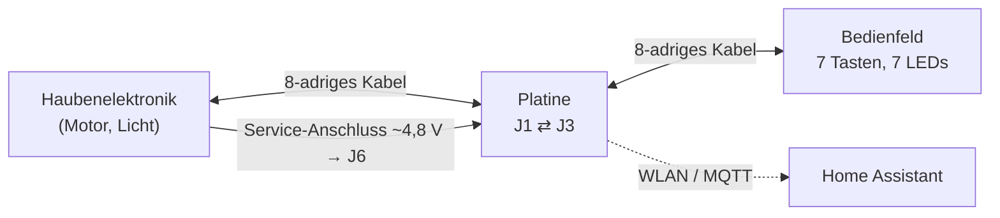
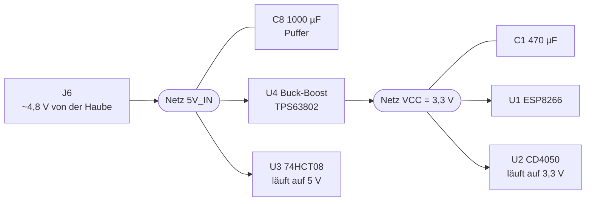
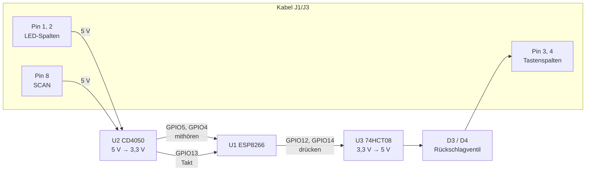

# Wie die Schaltung funktioniert

Diese Beschreibung erklärt die Platine der Haubensteuerung (Rev. 0.3) so, dass
man sie auch ohne Elektronik-Ausbildung und nach Jahren noch nachvollziehen
kann. Sie erklärt das *Warum*. Die genauen Bauteilwerte, Bestellnummern und
Layout-Details stehen in [`kicad/DESIGN.md`](../kicad/DESIGN.md), der
Schaltplan liegt als [`kicad/schematic.pdf`](../kicad/schematic.pdf) bei.

Inhalt:

1. [Die Aufgabe in einem Satz](#1-die-aufgabe-in-einem-satz)
2. [Ein paar Grundbegriffe](#2-ein-paar-grundbegriffe)
3. [Wie Haube und Bedienfeld miteinander reden](#3-wie-haube-und-bedienfeld-miteinander-reden)
4. [Überblick über die Platine](#4-überblick-über-die-platine)
5. [Stromversorgung](#5-stromversorgung)
6. [Der Mikrocontroller ESP8266](#6-der-mikrocontroller-esp8266)
7. [Mithören: Scan-Signal und LED-Zustände lesen (U2)](#7-mithören-scan-signal-und-led-zustände-lesen-u2)
8. [Mitreden: Tasten drücken (U3, D3, D4)](#8-mitreden-tasten-drücken-u3-d3-d4)
9. [Die Firmware im Takt der Haube](#9-die-firmware-im-takt-der-haube)
10. [Reset, Flashen und Status-LED](#10-reset-flashen-und-status-led)
11. [Steckverbinder und Messpunkte](#11-steckverbinder-und-messpunkte)
12. [Was wir bei der Inbetriebnahme gelernt haben](#12-was-wir-bei-der-inbetriebnahme-gelernt-haben)
13. [Fehlersuche: Was messe ich wo?](#13-fehlersuche-was-messe-ich-wo)

---

## 1. Die Aufgabe in einem Satz

Die Platine sitzt im Kabel zwischen der Elektronik der Dunstabzugshaube
(Gutmann Sombra) und ihrem Bedienfeld, **liest mit, welche Lämpchen am
Bedienfeld leuchten**, und kann **so tun, als hätte jemand eine Taste
gedrückt** – gesteuert per WLAN/MQTT aus Home Assistant.

Das Original-Bedienfeld funktioniert dabei ganz normal weiter. Die Platine
ist nur ein zusätzlicher „Zuhörer mit Fingern“.

---

## 2. Ein paar Grundbegriffe

Wer schon Elektronik kann, springt zu Abschnitt 3.

| Begriff | Bedeutung hier |
|---|---|
| **HIGH / LOW** | Digitale Signale kennen nur zwei Zustände. LOW ≈ 0 V (Masse), HIGH ≈ Versorgungsspannung, also 5 V bei der Haube und 3,3 V beim ESP. |
| **Masse / GND** | Der gemeinsame 0-V-Bezug. Spannungen werden immer gegen GND gemessen. Ohne gemeinsame Masse verstehen sich zwei Schaltungen nicht. |
| **Treiben** | Ein Ausgang, der eine Leitung aktiv auf HIGH oder LOW zwingt. |
| **Floaten / hochohmig** | Eine Leitung, an der niemand zieht. Ihr Pegel ist dann zufällig, sie „schwimmt“. CMOS-Eingänge dürfen nie floaten, sonst schalten sie wild hin und her. |
| **Pull-up / Pull-down** | Ein Widerstand (meist 10 kΩ), der eine Leitung sanft auf HIGH (up) bzw. LOW (down) zieht, solange sie niemand aktiv treibt. Ein Treiber kann ihn mühelos überstimmen. |
| **Gegentakt-Ausgang (push-pull)** | Ein Ausgang, der *immer* aktiv treibt – entweder HIGH oder LOW. Er kann nicht „loslassen“. |
| **Diode** | Ein elektrisches Ventil: Strom fließt nur von der Anode zur Kathode (Kathode = Ring auf dem Bauteil). In Durchlassrichtung „kostet“ sie etwa 0,6 V. |
| **Pegelwandler** | Übersetzt zwischen 5-V-Welt (Haube) und 3,3-V-Welt (ESP). |
| **Kondensator (Elko, Kerko)** | Ein kleiner Energiespeicher. Große Elkos (µF) puffern Stromspitzen, kleine Keramik-Kondensatoren (100 nF) direkt am IC fangen hochfrequente Störungen ab („Abblockkondensator“). |
| **Absolute Maximum** | Grenzwert aus dem Datenblatt, der nie überschritten werden darf. Für den ESP8266: 3,6 V an jedem Pin. |

---

## 3. Wie Haube und Bedienfeld miteinander reden

Das Verständnis dieses Abschnitts ist der Schlüssel zu allem anderen.

### Das Problem: 7 Tasten und 7 LEDs, aber nur 8 Adern

Würde man jede Taste und jede LED einzeln verdrahten, bräuchte man 14 Adern
plus Masse. Die Haube kommt mit einem 8-adrigen Netzwerkkabel aus – durch
**Multiplexing** (zeitliches Abwechseln).

Das Bedienfeld enthält nur passive Bauteile: 7 Taster, 7 LEDs und Leiterbahnen.
Alles Intelligente sitzt in der Haube.

### Die Matrix

Die Tasten und LEDs sind in einem Raster aus **4 Zeilen** und **2 Spalten**
angeordnet:

- **4 Scan-Leitungen (Zeilen)** – die Haube legt sie *nacheinander* für je
  1 ms auf 5 V (HIGH), die anderen drei stehen dabei auf 0 V. Nach 4 ms ist
  eine Runde durch, dann beginnt es von vorn – 250 Runden pro Sekunde.
- **2 Tastenleitungen (Spalten)** – eine Taste verbindet eine Zeile mit einer
  Spalte. Ist die Taste gedrückt, erscheint der HIGH-Impuls der Zeile auch
  auf der Spalte. Die Haube sieht also: *„Spalte 1 ist HIGH, während gerade
  Zeile 2 aktiv ist → das muss Taste Stufe 3 sein.“*
- **2 LED-Leitungen (Spalten)** – für eine LED, die leuchten soll, schaltet
  die Haube die LED-Spalte genau während der zugehörigen Zeile so, dass Strom
  durch die LED fließt. Jede LED leuchtet also nur 1 ms von 4 ms – das Auge
  merkt das nicht. An der Platine gemessen bedeutet ein **HIGH auf der
  LED-Spalte in der Mitte des Zeilenfensters: LED an** (so wertet es die
  Firmware aus, und so stimmen die gemeldeten Zustände mit dem Bedienfeld
  überein).

```mermaid
gantt
    title Eine Runde = 4 ms (danach beginnt Zeile A von vorn)
    dateFormat x
    axisFormat %L ms
    section Zeile A
    HIGH :a1, 0, 1ms
    section Zeile B
    HIGH :b1, 1, 1ms
    section Zeile C
    HIGH :c1, 2, 1ms
    section Zeile D
    HIGH :d1, 3, 1ms
    section Tastenspalte
    HIGH (Taste in Zeile B gedrückt) :crit, t1, 1, 1ms
```

**Die entscheidende Erkenntnis:** Eine Taste zu drücken heißt elektrisch nur,
*im richtigen Millisekunden-Fenster* eine Tastenspalte auf HIGH zu bringen.
Genau das macht die Platine. Und eine LED abzulesen heißt, im richtigen
Fenster nachzusehen, welchen Pegel die LED-Spalte hat.

### Die Adern des Kabels

Das Kabel ist ein Netzwerkkabel mit Farbcode T568B. **Es führt keine Masse
und keine Versorgung** – die holt sich die Platine separat (Abschnitt 5).

| Ader (Pin) | Farbe | Funktion | Platine greift ab |
|---|---|---|---|
| 1 | orange-weiß | LED-Spalte | ja → U2 → GPIO5 |
| 2 | orange | LED-Spalte | ja → U2 → GPIO4 |
| 3 | grün-weiß | Tastenspalte | ja ← D3 ← U3 ← GPIO12 |
| 4 | blau | Tastenspalte | ja ← D4 ← U3 ← GPIO14 |
| 5, 6, 7 | blau-weiß, grün, braun-weiß | drei Scan-Zeilen | nein, nur durchgeschleift |
| 8 | braun | Scan-Zeile „SCAN“ | ja → U2 → GPIO13 (Taktgeber) |

Die Platine hört nur **eine** der vier Scan-Zeilen ab. Das genügt: Kennt man
den Beginn einer Runde, ergeben sich die anderen drei Zeilen aus der Uhrzeit
(je 1 ms später).

---

## 4. Überblick über die Platine

| Bauteil | Aufgabe in einem Satz |
|---|---|
| **U1** ESP-12E | Der Mikrocontroller mit WLAN – das Gehirn. |
| **U2** CD4050 | Übersetzt die 5-V-Signale der Haube in 3,3 V für den ESP. |
| **U3** 74HCT08 | Übersetzt die 3,3-V-Signale des ESP in 5 V für die Haube. |
| **D3, D4** | Sorgen dafür, dass U3 die Tastenleitungen nur hochziehen, aber nie festhalten kann. |
| **R7, R8** | Halten die Eingänge von U3 auf LOW, solange der ESP noch bootet. |
| **U4** TPS63802-Modul | Macht aus den ~4,8 V der Haube stabile 3,3 V. |
| **C8, C1** | Große Energiepuffer vor bzw. hinter U4. |
| **C3–C6** | Abblockkondensatoren, je einer direkt an jedem IC. |
| **R5** | Zieht die SCAN-Leitung sauber auf LOW, wenn sie nicht aktiv ist. |
| **D1, D2** | Sitzen in den LED-Leitungen zwischen Bedienfeld und Haube (aus der Lochraster-Version übernommen). |
| **R2, R3, R4, R6, C7, SW1, SW2, J5** | Start-, Reset- und Flash-Beschaltung des ESP. |

---

## 5. Stromversorgung

### Woher der Strom kommt

Die Haubenelektronik hat einen **Service-Anschluss** mit ca. **4,8 V**, der
laut Messung etwa **500 mA** liefern kann. Er wird mit einem gekürzten
ISA-Slot-Stecker abgegriffen und an **J6** angelötet (Pin 1 = +, Pin 2 = GND).
Über diesen Anschluss kommt auch die **gemeinsame Masse** mit der Haube –
ohne sie könnte die Platine die Signale im Kabel gar nicht auswerten, weil
Spannungen immer relativ zur Masse gemessen werden.

### Warum 3,3 V und nicht einfach 5 V

Der ESP8266 läuft mit 3,3 V und verträgt **höchstens 3,6 V** an jedem Pin.
Die 5 V der Haube würden ihn zerstören.

### Warum ein Buck-Boost-Wandler (U4)

Ein Spannungswandler macht aus einer Spannung eine andere, ohne die
Differenz wie ein Linearregler in Wärme zu verheizen.

- Ein **Buck** (Abwärtswandler) braucht am Eingang deutlich *mehr* als die
  Ausgangsspannung – typische Module 4,5 bis 6 V. Die Haube liefert aber nur
  4,8 V, und wenn der ESP beim WLAN-Senden kurz ~350 mA zieht, sackt die
  Spannung weiter ab. Dann fällt der Buck aus der Regelung, der ESP bekommt
  zu wenig Spannung, startet neu, zieht beim Start wieder viel Strom … Das
  war der **Brownout-Boot-Loop** der alten Lochrasterplatine.
- Ein **Buck-Boost** kann auch *hochsetzen*. Der TPS63802 regelt von 1,5 V bis
  5,5 V am Eingang sauber auf 3,3 V. Egal wie weit die Haubenspannung kurz
  einbricht – die 3,3 V bleiben stehen.

**Achtung:** Das Modul wird ab Werk auf 4,2 V ausgeliefert und muss vor dem
Einbau per Lötbrücke auf **3,3 V** umgestellt und nachgemessen werden (steht
auch als Aufdruck auf der Platine).

### Die Kondensatoren

- **C8, 1000 µF, am 5-V-Eingang:** Speichert Energie für kurze Stromspitzen,
  damit die Leitung von der Haube nicht bei jedem WLAN-Paket einknickt.
- **C1, 470 µF, am 3,3-V-Ausgang:** Überbrückt die Zeit (~100 µs), die der
  Wandler braucht, um auf eine plötzliche Laständerung zu reagieren.
- **C3, C4, C5, C6, je 100 nF:** Sitzen direkt an U1, U2, U3 und U4. ICs
  schalten sehr schnell und ziehen dabei winzige, aber steile Stromspitzen.
  Diese kleinen Kondensatoren liefern sie „aus nächster Nähe“, bevor Störungen
  über die Leiterbahnen wandern.

Es gibt damit **zwei Spannungsnetze**: `5V_IN` (Haube, U3, C5, C8) und `VCC`
= 3,3 V (ESP, U2, alles andere).

---

## 6. Der Mikrocontroller ESP8266

Der **ESP-12E** ist ein fertiges Modul mit ESP8266-Chip, Flash-Speicher und
Antenne. Die Antenne ist die Zickzack-Leiterbahn an der Schmalseite; unter
ihr darf kein Kupfer liegen (Keep-out-Zone links auf der Platine).

Genutzte Pins:

| Pin | Richtung | Funktion |
|---|---|---|
| GPIO13 | Eingang | SCAN-Takt der Haube (über U2) |
| GPIO4, GPIO5 | Eingang | LED-Spalten (über U2) |
| GPIO12, GPIO14 | Ausgang | Tastenspalten (über U3 und D3/D4) |
| GPIO2 | Ausgang | blaue Status-LED auf dem Modul |
| GPIO0, GPIO15, EN, RST | – | Startverhalten, siehe Abschnitt 10 |
| TXD, RXD | – | serielle Schnittstelle zum Flashen (J2) |

---

## 7. Mithören: Scan-Signal und LED-Zustände lesen (U2)

### Das Problem

Die Signale im Kabel haben 5 V. Direkt an den ESP angeschlossen, würden sie
dessen Grenze von 3,6 V überschreiten.

### Die Lösung: CD4050 als Pegelwandler

Der **CD4050** enthält sechs „Buffer“: Was vorne reinkommt, kommt hinten
unverändert heraus. Seine besondere Eigenschaft: **Seine Eingänge vertragen
bis zu 15 V, auch wenn er selbst nur mit 3,3 V versorgt wird.** Die Ausgänge
liefern aber nur so viel, wie die Versorgung hergibt.

Weil U2 mit 3,3 V läuft, wird aus einem 5-V-HIGH im Kabel ein 3,3-V-HIGH am
ESP – genau passend.

- Buffer A: LED-Spalte Pin 2 → GPIO4
- Buffer B: LED-Spalte Pin 1 → GPIO5
- Buffer C: SCAN (Pin 8) → GPIO13
- Buffer D, E, F werden nicht gebraucht. Ihre Eingänge (Pin 9, 11, 14) liegen
  **fest auf GND**, weil offene CMOS-Eingänge floaten und dann Strom ziehen
  oder schwingen würden.

Nebeneffekt: Die Eingänge des CD4050 sind sehr hochohmig. Die Platine
belastet die Leitungen der Haube beim Mithören praktisch nicht.

### R5: der Pull-down auf SCAN

Die SCAN-Zeile wird von der Haube nur *auf HIGH* aktiv getrieben. In der
restlichen Zeit ist sie nicht sauber definiert. **R5 (2,4 kΩ) nach GND** zieht
sie dann eindeutig auf LOW, sodass der ESP saubere Flanken sieht. Der Wert
ist empirisch: 10 kΩ waren zu schwach, ~2,5 kΩ ergaben ein sauberes Signal.

---

## 8. Mitreden: Tasten drücken (U3, D3, D4)

Das ist der heikelste Teil der Schaltung – und der, der bei der
Inbetriebnahme die meisten Probleme gemacht hat.

### Die Anforderung

Die Tastenspalten gehören **der Haube und dem Bedienfeld**. Die Platine muss
zwei Dinge können:

1. **Drücken:** die Spalte im richtigen Zeitfenster auf HIGH (~5 V) bringen.
2. **Nichts tun:** die Spalte **völlig in Ruhe lassen**, damit das echte
   Bedienfeld weiter funktioniert – und zwar **in jedem Zustand**: im
   Normalbetrieb, während der ESP bootet, wenn er abgestürzt ist und wenn er
   gar keinen Strom hat.

### Schritt 1: 3,3 V → 5 V mit dem 74HCT08 (U3)

Ein ESP-HIGH hat nur 3,3 V. Der **74HCT08** ist eigentlich ein UND-Gatter
(Ausgang HIGH, wenn beide Eingänge HIGH sind). Legt man beide Eingänge
zusammen, wird es zum einfachen Verstärker: HIGH rein → HIGH raus.

Warum gerade die **HCT**-Familie: Sie läuft mit 5 V, erkennt aber schon
**ab 2,0 V** ein HIGH. Die 3,3 V des ESP reichen also sicher, und der Ausgang
liefert volle 5 V. (Ein normaler HC- oder CMOS-Baustein an 5 V bräuchte
~3,5 V als HIGH – das wäre zu knapp.)

- Gatter A: GPIO12 → Pin 1+2 → Pin 3
- Gatter B: GPIO14 → Pin 4+5 → Pin 6
- Gatter C, D unbenutzt, Eingänge fest auf GND (wie bei U2).

### Schritt 2: Die Dioden D3 und D4 – warum sie unverzichtbar sind

U3 hat **Gegentakt-Ausgänge**: Er treibt immer entweder HIGH oder LOW. Hinge
sein Ausgang direkt an der Tastenspalte, würde er sie die meiste Zeit **auf
LOW festhalten**. Dann könnte das echte Bedienfeld keine Taste mehr melden,
und bei zufälligen HIGH-Pegeln sähe die Haube Phantomtasten.

Die Diode wirkt wie ein Rückschlagventil:

| U3-Ausgang | Diode | Tastenspalte | Haube sieht |
|---|---|---|---|
| HIGH (5 V) | leitet | ≈ 4,3 V | „Taste gedrückt“ |
| LOW (0 V) | sperrt | frei | nichts – das Bedienfeld funktioniert normal |

Die 0,6 V, die die Diode „kostet“, stören nicht: 4,3 V sind für die
5-V-Elektronik der Haube ein eindeutiges HIGH.

Zusätzlicher Schutz: Die 5-V-Impulse auf der Spalte kommen nie beim ESP an.
Sie treffen höchstens auf die gesperrte Diode.

### Schritt 3: Die Pull-downs R7 und R8

Nach dem Einschalten dauert es einige 100 Millisekunden, bis die Firmware
läuft und GPIO12/14 aktiv auf LOW setzt. In dieser Zeit sind die Pins
unbestimmt – U3 dagegen läuft an 5 V sofort mit. Ohne weitere Maßnahme
würden seine Eingänge floaten, und er könnte zufällig HIGH ausgeben – ein
Phantom-Tastendruck genau beim Einschalten.

**R7 und R8 (je 10 kΩ nach GND)** halten die U3-Eingänge in dieser Zeit
sicher auf LOW. Sobald der ESP läuft, überstimmt er sie problemlos.

### Warum nicht einfacher?

Genau diese einfacheren Varianten wurden bei der Inbetriebnahme ausprobiert
und scheiterten (Details in Abschnitt 12):

| Variante | Ergebnis |
|---|---|
| U3 direkt an der Spalte (Rev. 0.2) | ESP bootet in Schleife, Haube zeigt Phantomtasten und reagiert nicht mehr |
| Drahtbrücke: GPIO direkt an die Spalte (wie auf der Lochrasterplatine) | Bedienfeld-LEDs glimmen nur, ESP hängt sich auf |
| Widerstand 1–2,4 kΩ statt Draht | Haube startet mit Fehlercode |
| **U3 + Diode + Pull-down (Rev. 0.3)** | **funktioniert** |

Der gemeinsame Grund für das Scheitern der direkten Varianten: Hängt der
ESP-Pin elektrisch an der Spalte, wirken seine internen Schutzdioden wie
ein Kurzschluss zur 3,3-V-Schiene. Solange der ESP noch keinen Strom hat,
ziehen sie die Spalte nach unten; wenn er läuft, speisen die 5-V-Impulse
über sie in seine Versorgung zurück.

---

## 9. Die Firmware im Takt der Haube

Die Elektronik allein reicht nicht – der ESP muss im richtigen Moment
hinsehen und drücken. So macht es die Firmware ([`src/main.cpp`](../src/main.cpp)):

### Synchronisieren

1. Jede steigende Flanke auf **SCAN** (GPIO13) löst einen Interrupt aus.
2. Liegen zwischen zwei Flanken ziemlich genau **4 ms** (3,9–4,1 ms), ist das
   der Rundenbeginn. Nach mehr als 10 solchen Flanken startet ein Hardware-Timer
   neu, der alle **100 µs** tickt.
3. **40 Ticks = 4 ms = eine Runde.** Die Firmware weiß also jederzeit, welche
   der vier Zeilen gerade aktiv ist.

### Der Ablauf innerhalb einer Runde

| Tick | Aktion |
|---|---|
| 1, 11, 21, 31 | Zeile beginnt: soll in dieser Zeile eine Taste gedrückt werden, GPIO auf HIGH |
| 5, 15, 25, 35 | Mitte der Zeile: LED-Spalten lesen |
| 9, 19, 29, 39 | vor dem Zeilenwechsel: beide Tasten-GPIOs wieder LOW |

Das Drücken endet bewusst *vor* dem Zeilenwechsel, damit ein Tastendruck
nicht in die nächste Zeile „überläuft“ und dort eine falsche Taste auslöst.

### Welche Taste und LED wo liegt

„Kanal 1“ = LED-Spalte J1/2 (GPIO4) bzw. Tastenspalte J1/4 (GPIO14),
„Kanal 2“ = LED-Spalte J1/1 (GPIO5) bzw. Tastenspalte J1/3 (GPIO12).

| Zeitfenster (Ticks) | Kanal 1 | Kanal 2 |
|---|---|---|
| 1–10 | Lüfter Stufe 2 | Licht |
| 11–20 | Lüfter Stufe 3 | Filter reinigen |
| 21–30 | Lüfter Stufe 4 | – |
| 31–40 | Lüfter Stufe 1 | Timer (Nachlauf) |

(Die beiden Kanäle kommen gegenüber der Lochraster-Firmware vertauscht an;
das ist in der Firmware ausgeglichen, siehe `ledPin1/2` und `buttonPin1/2`.)

### Drücken und Lesen im Detail

- **Drücken:** Ein MQTT-Befehl setzt einen Zähler, z. B. 100. In jeder Runde,
  in der die Zeile dran ist, wird HIGH ausgegeben und der Zähler verringert.
  100 Runden × 4 ms = **0,4 s** Tastendruck. „Filter reinigen“ wird mit 1500
  Runden = **6 s** lang gedrückt – die Haube erwartet dort offenbar einen
  langen Druck, damit man die Filteranzeige nicht versehentlich zurücksetzt.
- **Lesen:** Eine LED gilt erst dann als umgeschaltet, wenn sie **mehr als
  20 Runden hintereinander** (80 ms) im neuen Zustand war. Das filtert
  Störungen heraus. Ausnahme Filter-LED: Ist sie an, muss sie für „aus“
  deutlich länger (375 Runden = 1,5 s) dunkel bleiben – vermutlich, weil sie
  im eingeschalteten Zustand blinkt.
- Jede erkannte Änderung wird per MQTT gemeldet (`…/ventilation/state`,
  `…/light/state`, `…/timer/state`, `…/maintenance/state`).

---

## 10. Reset, Flashen und Status-LED

Der ESP8266 entscheidet beim Einschalten anhand einiger Pins, *was* er tut.
Diese Pins brauchen definierte Pegel:

| Pin | muss beim Start sein | erledigt durch |
|---|---|---|
| **EN** (Enable) | HIGH, sonst schläft der Chip | R4 (10 kΩ) nach 3,3 V |
| **RST** (Reset) | HIGH, LOW = Neustart | R6 (10 kΩ) nach 3,3 V; SW1 bzw. J4 ziehen auf GND |
| **GPIO15** | LOW | R3 (10 kΩ) nach GND |
| **GPIO0** | HIGH = Programm starten, LOW = Flash-Modus | Jumper J5 |

### Jumper J5 (Flash/Run)

| Stellung | Wirkung |
|---|---|
| **1–2 = RUN** (Normalbetrieb) | R2 zieht GPIO0 auf HIGH → Firmware startet |
| 2–3 = FLASH | GPIO0 auf GND → ESP wartet auf neue Firmware |

**Der Jumper muss immer stecken.** Ohne ihn floatet GPIO0 und der ESP startet
unzuverlässig – das war auf der Lochrasterplatine die Hauptursache für
sporadische Bootfehler.

**SW2 (Flash)** zieht GPIO0 ebenfalls auf GND. Wird er beim Start gehalten,
löscht die Firmware die gespeicherten WLAN- und MQTT-Einstellungen.

### Flashen über J2

J2 ist die Buchse für einen USB-Seriell-Adapter (FTDI, 3,3 V):
DTR – RXI – TXO – 3V3 – NC – GND.

- **C7 (100 nF)** koppelt die DTR-Leitung auf RST. Wenn das Flash-Programm
  DTR umschaltet, entsteht ein kurzer Reset-Impuls (automatischer Reset).
  Es muss ein *ungepolter* Keramik-Kondensator sein, weil die Spannung an
  ihm beide Richtungen annehmen kann.
- GPIO0 wird **nicht** automatisch umgeschaltet: Zum seriellen Flashen J5
  auf FLASH stecken, danach zurück auf RUN und Reset drücken.
- Im Alltag wird ohnehin **per WLAN (OTA)** geflasht, siehe
  [`OPERATIONS.md`](OPERATIONS.md).

**Wichtig:** Über den 3V3-Pin von J2 versorgt der Adapter den ESP direkt mit
3,3 V. Ein Test nur am Adapter sagt deshalb **nichts** über die eigentliche
Stromversorgung über J6 und U4 aus.

### Status-LED (blau, auf dem ESP-Modul)

| Muster | Bedeutung |
|---|---|
| 3 kurze Blitze | Start |
| schnell (150 ms) | verbindet mit WLAN |
| mittel (400 ms) | verbindet mit MQTT |
| langsam (1 s) | Einrichtungs-Hotspot `HoodControl-Setup` aktiv |
| alle 3 s ein kurzer Blitz | alles in Ordnung |
| dauerhaft dunkel | Firmware hängt |

---

## 11. Steckverbinder und Messpunkte

| Bezeichnung | Art | Zweck |
|---|---|---|
| **J1** Hoodcontrol | Adern direkt eingelötet | Kabel zur Haubenelektronik |
| **J3** Frontpanel | Adern direkt eingelötet | Kabel zum Bedienfeld |
| **J6** PWR_IN | Adern direkt eingelötet | 5 V und GND vom Service-Anschluss |
| **J2** | Stiftleiste 1×6 | USB-Seriell-Adapter zum Flashen |
| **J4** | Stiftleiste 1×2 | externer Reset-Taster (parallel zu SW1) |
| **J5** | Stiftleiste 1×3 + Jumper | RUN/FLASH |

J1, J3 und J6 haben keine Stecker, weil ein aufgesteckter Stecker samt
Kabelbogen zu hoch für das Gehäuse wäre (Grenze: 14 mm Bauhöhe). Die Kabel
werden an den Bohrungen H1–H4 mit Kabelbindern zugentlastet.

| Messpunkt | Soll |
|---|---|
| **TP3** | 5V_IN, ~4,8 V |
| **TP4** | VCC, 3,3 V (nie über 3,6 V!) |
| **TP5** | SCAN – mit Oszilloskop: 1-ms-Impulse alle 4 ms |
| **TP1, TP2, TP6** | GND, Bezug für alle Messungen |

---

## 12. Was wir bei der Inbetriebnahme gelernt haben

Chronologie der Inbetriebnahme im September 2026, damit die Entscheidungen
nachvollziehbar bleiben:

1. **Nur am FTDI-Adapter:** ESP geflasht, WLAN und MQTT laufen. (Das testet
   die 3,3-V-Seite, nicht U4 – siehe Abschnitt 10.)
2. **Mit Haube, U3 direkt an der Tastenspalte (Rev. 0.2):** Boot-Schleife,
   Phantomtasten „Stufe 3“ und „Filter reinigen“ – beide liegen in Zeile 2,
   also sah die Haube *beide* Tastenspalten gleichzeitig HIGH. Ursache: U3
   treibt die Spalten mit zufälligen Pegeln (Abschnitt 8).
3. **U3 gezogen:** stabil, LEDs werden gelesen – aber Lüfter 1 wird als
   „Timer“, Lüfter 2 als „Licht“ erkannt: gleiche Zeile, falscher Kanal →
   LED-Kanäle vertauscht, in der Firmware korrigiert.
4. **Drahtbrücke statt U3:** Bedienfeld-LEDs glimmen, ESP hängt sich auf Haubenstrom auf.
5. **Widerstand statt Draht:** Haube startet mit Fehlercode.
6. **U3 mit Diode und Pull-downs:** funktioniert. „Licht an“ schaltet
   Stufe 2 → auch die Tastenkanäle vertauscht, in der Firmware korrigiert.
7. **Haubenlicht geht beim Einschalten an:** Das macht die Haube auch ganz ohne
   Platine – kein Fehler der Schaltung.

Die Lochrasterplatine hatte GPIO12/14 direkt an den Tastenspalten und lief
damit jahrelang, allerdings mit 5 V an Pins, die nur 3,6 V vertragen. Das
gelegentliche „plötzliche Loslaufen“ der Haube in dieser Zeit passt gut zu
Phantomtasten über diesen Weg. Mit Rev. 0.3 ist der ESP elektrisch von den
Tastenspalten getrennt.

---

## 13. Fehlersuche: Was messe ich wo?

| Symptom | Zuerst prüfen |
|---|---|
| ESP startet gar nicht | TP4 = 3,3 V? Jumper J5 auf RUN (1–2)? |
| ESP startet immer wieder neu | TP3 und TP4 während des Blinkens messen; bricht TP4 ein → U4/Lötstellen |
| Haube zeigt Tasten, die niemand drückt | U3 ziehen – verschwindet es, liegt es am Tastenpfad (Dioden, Pull-downs, Firmware) |
| Bedienfeld-LEDs glimmen nur | Etwas belastet die LED- oder Scan-Leitungen – Brücken/Bauteile an U2 und J1 prüfen |
| LED-Zustände falsch zugeordnet | gleiche Zeile, anderer Kanal? → `ledPin1/2` tauschen |
| MQTT-Befehl drückt falsche Taste | gleiche Zeile, anderer Kanal? → `buttonPin1/2` tauschen |
| Keine LED-Zustände, obwohl ESP läuft | SCAN an TP5 prüfen; R5 vorhanden? U2 richtig herum im Sockel? |
| Nichts auf der seriellen Schnittstelle | Adapter richtig herum auf J2 (GND an Pin 6)? TX/RX vertauscht? |

Grundregel beim Umstecken von ICs, Brücken oder Kabeln: **immer stromlos.**
